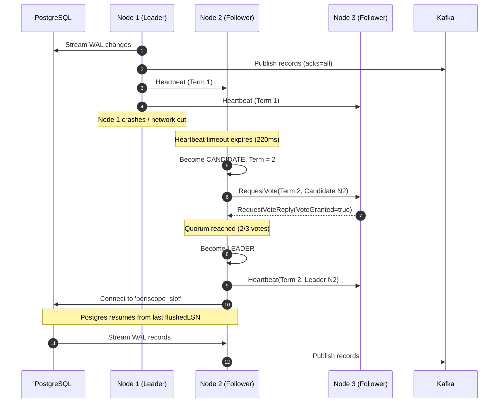

# Periscope — Architecture Specification (Path A)

This document provides a comprehensive technical specification for the **Periscope** architecture (**Path A: PostgreSQL Change Data Capture with Apache Kafka & Raft Consensus High Availability**).

---

## 1. Executive Summary

**Periscope** is a distributed, fault-tolerant Change Data Capture (CDC) system designed to stream committed row-level database mutations from PostgreSQL to downstream consumers in real time. 

Rather than relying on inefficient periodic table polling, Periscope taps directly into PostgreSQL's Write-Ahead Log (WAL) via logical replication. It transforms raw database operations into standardized, strongly-typed JSON change events, routes them to Apache Kafka topics partitioned by primary key, and employs a Raft consensus cluster to ensure high availability, automatic leader failover, and zero split-brain operation.

---

## 2. Core Architectural Pillars

1. **Non-Polling Event Detection:** Intercepts database mutations at the storage engine level using PostgreSQL logical decoding.
2. **Strict Chronological Ordering:** Enforces total order per row by partitioning Kafka topics using the row's Primary Key.
3. **End-to-End Durability:** Coordinates Kafka delivery confirmations (`acks=all`) directly with PostgreSQL's Log Sequence Number (LSN) feedback loop before WAL segments are released.
4. **Active-Passive High Availability:** Runs a multi-node Periscope cluster coordinated by Raft consensus to guarantee that exactly one node holds the replication lease while hot standbys monitor leader health.
5. **Standardized Downstream Integration:** Publishes to Apache Kafka, enabling clients in any programming language to utilize battle-tested Kafka consumer groups, offset checkpointing, and replay capabilities.

---

## 3. High-Level System Architecture

```
┌─────────────────────────────────────────────────────────────────────────────┐
│                             SOURCE DATABASE                                 │
│                                                                             │
│   ┌─────────────────────────────────────────────────────────────────────┐   │
│   │                        PostgreSQL 16+                               │   │
│   │                                                                     │   │
│   │   [Table: orders]   [Table: customers]     Write-Ahead Log (WAL)   │   │
│   │         │                  │               ┌─────────────────────┐  │   │
│   │         └─────────┬────────┘               │ LSN 0/16B0000       │  │   │
│   │                   │ Transactions Committed │ LSN 0/16B0080       │  │   │
│   │                   └───────────────────────>│ LSN 0/16B0120       │  │   │
│   │                                            └──────────┬──────────┘  │   │
│   │                                                       │             │   │
│   │             Replication Slot ("periscope_slot")       │             │   │
│   │             Output Plugin: test_decoding / pgoutput   │             │   │
│   └───────────────────────────────┬───────────────────────┴─────────────┘   │
└───────────────────────────────────┼─────────────────────────────────────────┘
                                    │ Logical Replication Stream
                                    │ (Postgres enforces single active client)
                                    ▼
┌─────────────────────────────────────────────────────────────────────────────┐
│                           PERISCOPE CLUSTER                                 │
│                                                                             │
│   ┌─────────────────────────────────────────────────────────────────────┐   │
│   │                      ACTIVE LEADER (Node 1)                         │   │
│   │                                                                     │   │
│   │  ┌───────────────────────┐         ┌─────────────────────────────┐  │   │
│   │  │   Ingestion Engine    │         │       Change Parser         │  │   │
│   │  │ (PGReplicationStream) │ ──────> │  (WAL to ChangeEvent record)│  │   │
│   │  └───────────────────────┘         └──────────────┬──────────────┘  │   │
│   │             ▲                                     │                 │   │
│   │             │ Acknowledge LSN                     ▼                 │   │
│   │  ┌──────────┴────────────┐         ┌─────────────────────────────┐  │   │
│   │  │    LSN Coordinator    │         │       Kafka Publisher       │  │   │
│   │  │ (flushedLSN feedback) │ <────── │      (acks=all callback)    │  │   │
│   │  └───────────────────────┘         └──────────────┬──────────────┘  │   │
│   │                                                   │                 │   │
│   │  ┌────────────────────────────────────────────────┴──────────────┐  │   │
│   │  │ Raft Consensus Engine (Sends heartbeats, maintains lease)     │  │   │
│   │  └───────────────────────────────────────────────────────────────┘  │   │
│   └───────────────────────────────────┬─────────────────────────────────┘   │
│                                       │                                     │
│                     Raft Heartbeats / RPC (TCP Sockets)                     │
│                                       │                                     │
│               ┌───────────────────────┴───────────────────────┐             │
│               ▼                                               ▼             │
│   ┌───────────────────────┐                       ┌───────────────────────┐ │
│   │   FOLLOWER (Node 2)   │                       │   FOLLOWER (Node 3)   │ │
│   │     (Hot Standby)     │                       │     (Hot Standby)     │ │
│   │  Election timer reset │                       │  Election timer reset │ │
│   └───────────────────────┘                       └───────────────────────┘ │
└───────────────────────────────────────┬─────────────────────────────────────┘
                                        │ Idempotent Produce
                                        │ Topic: periscope.<schema>.<table>
                                        │ Key: Primary Key
                                        ▼
┌─────────────────────────────────────────────────────────────────────────────┐
│                             EVENT BACKBONE                                  │
│                                                                             │
│   ┌─────────────────────────────────────────────────────────────────────┐   │
│   │                          Apache Kafka                               │   │
│   │                                                                     │   │
│   │   Topic: periscope.public.customers     Topic: periscope.public.orders│ │
│   │   ┌───────────────────────────────┐     ┌─────────────────────────┐ │   │
│   │   │ Partition 0: [PKey: 1, 3, 5]  │     │ Partition 0: [PKey: 10] │ │   │
│   │   │ Partition 1: [PKey: 2, 4, 6]  │     │ Partition 1: [PKey: 20] │ │   │
│   │   └───────────────────────────────┘     └─────────────────────────┘ │   │
│   └───────────────────────────────────┬─────────────────────────────────┘   │
└───────────────────────────────────────┼─────────────────────────────────────┘
                                        │
                                        │ Kafka Consumer Protocol
                                        ▼
┌─────────────────────────────────────────────────────────────────────────────┐
│                          DOWNSTREAM CONSUMERS                               │
│                                                                             │
│   ┌───────────────────────────┐           ┌─────────────────────────────┐   │
│   │   Consumer Group: email   │           │   Consumer Group: analytics │   │
│   │    (Reacts to new users)  │           │    (Updates metrics cache)  │   │
│   └───────────────────────────┘           └─────────────────────────────┘   │
└─────────────────────────────────────────────────────────────────────────────┘
```

---

## 4. Component Deep Dive

### 4.1 PostgreSQL CDC Ingestion Engine

#### Write-Ahead Log (WAL) & LSNs
PostgreSQL writes all data modifications to the WAL prior to altering database pages. Every log record receives a monotonically increasing 64-bit integer called a **Log Sequence Number (LSN)**, representing its byte offset in the WAL journal (e.g., `0/16B0120`).

#### Logical Decoding & Replication Slots
Periscope utilizes PostgreSQL's logical decoding feature:
* **Replication Slot:** A named stream position tracker on Postgres (`periscope_slot`). Postgres guarantees that WAL segments are never deleted from disk until all active replication slots have acknowledged consuming them.
* **Output Plugin:** Formats the WAL stream. Periscope supports `test_decoding` (human-readable key-value text) and can be extended to `pgoutput` (PostgreSQL binary logical replication protocol).
* **Single Active Consumer Invariant:** PostgreSQL explicitly forbids concurrent connections to a single replication slot. If Node 1 is connected, any attempt by Node 2 to connect throws an error (`ERROR: replication slot "periscope_slot" is active for PID ...`). This makes a coordination layer (Raft) mandatory.

#### The LSN Feedback Loop
To prevent PostgreSQL from exhausting disk space with accumulated WAL files, Periscope maintains a continuous acknowledgment loop:
1. `appliedLSN`: The LSN of the change event currently being processed in memory.
2. `flushedLSN`: The highest LSN confirmed to be durably written to Kafka.
3. Periscope periodically issues a status update to PostgreSQL:
   ```java
   stream.setFlushedLSN(LogSequenceNumber.valueOf(flushedLsn));
   stream.forceUpdateStatus();
   ```
4. PostgreSQL safely purges or recycles WAL files older than the slot's `confirmed_flush_lsn`.

---

### 4.2 Change Event Model & Serialization

Change events are represented using immutable Java `record`s:

```java
public record ChangeEvent(
    String schemaName,
    String tableName,
    OperationType operation,
    long lsn,
    Instant timestamp,
    Map<String, Object> before,
    Map<String, Object> after,
    String primaryKeyColumn
) {
    public Object getPrimaryKeyValue() {
        return (operation == OperationType.DELETE) 
            ? before.get(primaryKeyColumn) 
            : after.get(primaryKeyColumn);
    }
}
```

#### JSON Envelope Specification
Events published to Kafka adhere to a standardized JSON schema:

```json
{
  "source": {
    "schema": "public",
    "table": "customers",
    "lsn": 23789600,
    "lsnString": "0/16B0120",
    "ts": "2026-09-04T04:15:30.120Z"
  },
  "op": "UPDATE",
  "before": {
    "id": 42,
    "name": "Jane Doe",
    "status": "PENDING"
  },
  "after": {
    "id": 42,
    "name": "Jane Doe",
    "status": "ACTIVE"
  }
}
```

* **INSERT:** `before` is `null`, `after` contains the new row state.
* **UPDATE:** `before` contains the previous row state, `after` contains the new row state.
* **DELETE:** `before` contains the row state (or PK) prior to deletion, `after` is `null`.

---

### 4.3 Apache Kafka Publishing Backbone

#### Topic Routing & Partition Key Strategy
* **Topic Naming:** Events are routed to dedicated topics per table:
  $$\text{Topic} = \text{prefix} + "." + \text{schema} + "." + \text{table}$$
  Example: `periscope.public.customers`.
* **Primary Key Partitioning:** The Kafka message key is set to the entity's **Primary Key** (e.g., `"42"`).
  * In Kafka, messages with the same key always hash to the **same partition**.
  * Within a single partition, Kafka guarantees strict FIFO ordering.
  * **Result:** All updates to Customer `42` are processed in the exact order they committed in PostgreSQL, while updates to different customers execute in parallel across partitions.

#### Producer Reliability Configurations
* `acks=all`: The leader broker waits for the full set of in-sync replicas (ISRs) to acknowledge the record before responding.
* `enable.idempotence=true`: Assigns a Producer ID (PID) and sequence numbers to records, preventing duplicates on retries.
* `retries=Integer.MAX_VALUE`: Retries transient network failures indefinitely without losing message order.

#### Asynchronous Delivery Pipeline
```
[Postgres WAL Stream]
         │
         ▼
[CdcStreamConsumer] ─── parses Event ───> [KafkaChangePublisher]
                                                  │
                                                  ▼ (async produce)
                                        [CompletableFuture]
                                                  │
                                                  ▼ (on completion)
                                        [Advance flushedLSN] ───> [Postgres Slot]
```
If Kafka publishing fails or encounters backpressure, the stream consumer pauses reading, preventing LSN advancement and ensuring at-least-once delivery.

---

### 4.4 Raft Consensus & High Availability (HA)

#### The Problem Raft Solves
Since PostgreSQL only allows one consumer per replication slot, Periscope cannot use a multi-active deployment. We need an **active-passive** architecture with automated failover:
* Exactly one **Leader** holds the active PostgreSQL replication connection and produces to Kafka.
* **Followers** run in hot standby, maintaining cluster membership and monitoring the Leader's health.

#### Node State Machine
Each Periscope node operates in one of three states:
* **FOLLOWER:** Listens for periodic heartbeats from the Leader. Resets randomized election timer (150ms–300ms) on each heartbeat.
* **CANDIDATE:** If election timer expires without a heartbeat, increments `term`, votes for self, and broadcasts `RequestVote` RPCs to peers.
* **LEADER:** Upon receiving votes from a quorum ($N/2 + 1$ nodes), transitions to Leader:
  1. Activates `LeaderElectionController`.
  2. Connects to PostgreSQL's replication slot.
  3. Begins streaming changes and publishing to Kafka.
  4. Periodically sends `AppendEntries / Heartbeat` messages (every 50ms) to suppress new elections.

#### Leader Crash & Failover Sequence


---

## 5. Failure Modes & Resilience Analysis

| Failure Scenario | System Impact | Mitigation / Recovery |
| :--- | :--- | :--- |
| **Leader Node Dies** | Streaming briefly pauses. Followers miss heartbeats within 150–300ms. | A follower wins election via Raft quorum, connects to Postgres replication slot, and resumes streaming from the last flushed LSN. Zero missing events. |
| **Follower Node Dies** | None on data streaming. Leader continues streaming as long as a quorum exists. | When the follower recovers, it reconnects to cluster transport and receives heartbeats. |
| **Kafka Outage / Partition** | Kafka producer future fails or blocks. | Periscope stops acknowledging LSNs to Postgres. The pipeline pauses. When Kafka recovers, in-flight records are published and LSN advancement resumes. |
| **Postgres Disconnect** | Stream reading throws connection error. | Leader attempts exponential backoff reconnection. If persistent, leader steps down, allowing cluster to elect a leader that may have network connectivity. |
| **Network Partition (Split-Brain)** | Cluster split into two partitions (e.g. 1 node vs 2 nodes). | The minority node cannot achieve quorum ($1 < 2$) and cannot become or remain leader. The majority partition (2 nodes) elects a valid leader. |

---

## 6. Technology Stack & Java 21+ Features

* **Java 21 / 26:**
  * **Records (`java.lang.Record`):** Immutable domain event modeling and type-safe configuration.
  * **Sealed Interfaces:** Strict hierarchy for Raft RPC messages (`RequestVote`, `AppendEntries`) and domain events.
  * **Pattern Matching for Switch:** Clean, compiler-verified handling of event types and RPC states.
  * **Virtual Threads (Project Loom):** Lightweight execution of inter-node Raft socket communication.
* **Libraries:**
  * **PostgreSQL JDBC (`org.postgresql:postgresql:42.7.3`):** Replication stream protocol and slot management.
  * **Apache Kafka Clients (`org.apache.kafka:kafka-clients:3.7.0`):** Production producer and consumer APIs.
  * **Jackson Databind (`com.fasterxml.jackson.core:jackson-databind:2.17.1`):** JSON schema envelope serialization.
  * **SLF4J + Logback (`ch.qos.logback:logback-classic:1.5.6`):** Structured, asynchronous application logging.
  * **JUnit 5 (`org.junit.jupiter:junit-jupiter:5.10.2`):** Unit and integration testing.
