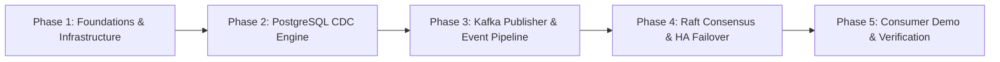

# Periscope — Implementation Plan & Roadmap

Periscope is a high-availability Change Data Capture (CDC) and event-streaming pipeline built in Java. It continuously captures row-level changes from PostgreSQL's Write-Ahead Log (WAL), routes them into Apache Kafka topics partitioned by primary key, and uses Raft consensus to coordinate leader election and seamless failover across Periscope nodes.

---

## High-Level Architecture

```
┌─────────────────┐
│   PostgreSQL    │
│  (WAL Stream)   │
└────────┬────────┘
         │ Logical Replication Stream (Single active connection allowed)
         ▼
┌───────────────────────────────────────────────────────────────┐
│                       PERISCOPE CLUSTER                       │
│                                                               │
│   ┌────────────────────────────────────────────────────────┐  │
│   │                  ACTIVE LEADER (Node 1)                │  │
│   │                                                        │  │
│   │   1. Ingestion: Reads Postgres WAL via Replication     │  │
│   │   2. Parser: Converts WAL to ChangeEvent Records       │  │
│   │   3. Kafka Publisher: Asynchronously emits to Kafka    │  │
│   │   4. LSN Checkpointer: Acknowledges flushed LSN        │  │
│   │   5. Heartbeats: Periodically renews Raft leadership   │  │
│   └────────────────────────────────────────────────────────┘  │
│                               │                               │
│                   Raft Heartbeats & Lease                     │
│                               ▼                               │
│   ┌─────────────────────────┐   ┌─────────────────────────┐   │
│   │  HOT STANDBY (Node 2)   │   │  HOT STANDBY (Node 3)   │   │
│   │  Monitors leader health │   │  Monitors leader health │   │
│   └─────────────────────────┘   └─────────────────────────┘   │
└───────────────────────────────┬───────────────────────────────┘
                                │ Produces with acks=all
                                ▼
                    ┌───────────────────────┐
                    │     Apache Kafka      │
                    │   Topic: per table    │
                    │   Key: Primary Key    │
                    └───────────┬───────────┘
                                │
                                ▼
                     Downstream Consumers
                     (Standard Kafka SDKs)
```

---

## Phase Breakdown & Manageable Tasks



---

### Phase 1: Foundations & Infrastructure Setup (Milestone 1)

**Goal:** Establish the project foundation, containerized infrastructure (Postgres + Kafka), and modern Java 21+ configuration.

- [ ] **[#6](https://github.com/drumilbhati/periscope/issues/6) - Setup Maven pom.xml with Java 21+ and Core Dependencies**
  - Target files: `pom.xml`, `.gitignore`
  - Configure compiler, surefire plugins, dependencies (Postgres JDBC, Kafka clients, Jackson, SLF4J, Logback, JUnit 5).
- [ ] **[#7](https://github.com/drumilbhati/periscope/issues/7) - Add Docker Compose for PostgreSQL (Logical Replication) and Kafka (KRaft)**
  - Target files: `docker-compose.yml`, `init.sql`
  - Postgres 16+ (`wal_level=logical`), Kafka in KRaft mode, schema initialization.
- [ ] **[#8](https://github.com/drumilbhati/periscope/issues/8) - Implement Type-Safe Database and Kafka Configuration Records**
  - Target files: `src/main/java/com/periscope/config/DatabaseConfig.java`, `src/main/java/com/periscope/config/KafkaConfig.java`
  - Compact constructor validation, invariant checks.
- [ ] **[#9](https://github.com/drumilbhati/periscope/issues/9) - Implement PeriscopeConfig Loader with Property Parsing**
  - Target files: `src/main/java/com/periscope/config/PeriscopeConfig.java`, `src/main/resources/application.properties`
  - Properties loading and environment variable overrides.
- [ ] **[#10](https://github.com/drumilbhati/periscope/issues/10) - Configure SLF4J and Logback Structured Logging**
  - Target files: `src/main/resources/logback.xml`
  - Pattern layouts, logger levels, clean console output.

---

### Phase 2: PostgreSQL CDC Ingestion Engine (Milestone 2)

**Goal:** Connect to PostgreSQL's logical replication stream, read WAL changes, and parse row mutations into typed Java models.

- [ ] **[#11](https://github.com/drumilbhati/periscope/issues/11) - Implement PostgresConnectionFactory for Replication Connections**
  - Target files: `src/main/java/com/periscope/cdc/PostgresConnectionFactory.java`, `src/test/java/com/periscope/cdc/PostgresConnectionFactoryTest.java`
  - Configure `PGProperty.REPLICATION`, connection lifecycle.
- [ ] **[#12](https://github.com/drumilbhati/periscope/issues/12) - Implement ReplicationSlotManager for Slot & Publication Lifecycle**
  - Target files: `src/main/java/com/periscope/cdc/ReplicationSlotManager.java`
  - Check, create, drop replication slots and publications idempotently.
- [ ] **[#13](https://github.com/drumilbhati/periscope/issues/13) - Model CDC ChangeEvent and OperationType using Java Records and Sealed Types**
  - Target files: `src/main/java/com/periscope/model/OperationType.java`, `src/main/java/com/periscope/model/ChangeEvent.java`
  - Immutable domain events, LSN, row before/after column maps.
- [ ] **[#14](https://github.com/drumilbhati/periscope/issues/14) - Implement WalMessageParser for test_decoding Stream Format**
  - Target files: `src/main/java/com/periscope/cdc/WalMessageParser.java`, `src/test/java/com/periscope/cdc/WalMessageParserTest.java`
  - Regex and string tokenization parsing WAL text to `ChangeEvent`.
- [ ] **[#15](https://github.com/drumilbhati/periscope/issues/15) - Implement CdcStreamConsumer with LSN Feedback Loop**
  - Target files: `src/main/java/com/periscope/cdc/CdcStreamConsumer.java`
  - Streaming loop with `PGReplicationStream`, background execution, `stream.setFlushedLSN()`.

---

### Phase 3: Kafka Publisher & Pipeline Integration (Milestone 3)

**Goal:** Transform parsed database changes into structured JSON events, partition them by primary key, and publish them to Kafka with strict delivery guarantees.

- [ ] **[#16](https://github.com/drumilbhati/periscope/issues/16) - Implement EventSerializer for JSON Schema Envelope**
  - Target files: `src/main/java/com/periscope/kafka/EventSerializer.java`, `src/test/java/com/periscope/kafka/EventSerializerTest.java`
  - Jackson `ObjectMapper` serialization into standard change envelope.
- [ ] **[#17](https://github.com/drumilbhati/periscope/issues/17) - Implement KafkaChangePublisher with Idempotent Settings**
  - Target files: `src/main/java/com/periscope/kafka/KafkaChangePublisher.java`
  - `KafkaProducer` with `acks=all`, `enable.idempotence=true`, wrapping callbacks into `CompletableFuture`.
- [ ] **[#18](https://github.com/drumilbhati/periscope/issues/18) - Implement TopicRouter for Table-to-Topic and PK Partitioning**
  - Target files: `src/main/java/com/periscope/kafka/TopicRouter.java`, `src/test/java/com/periscope/kafka/TopicRouterTest.java`
  - Topic name resolution (`periscope.<schema>.<table>`) and row primary key extraction.
- [ ] **[#19](https://github.com/drumilbhati/periscope/issues/19) - Implement CdcPipelineCoordinator Linking CDC Stream and Kafka Acks**
  - Target files: `src/main/java/com/periscope/pipeline/CdcPipelineCoordinator.java`
  - End-to-end coordination: advance Postgres LSN only after Kafka broker ack.

---

### Phase 4: Raft Consensus & High Availability (Milestone 4)

**Goal:** Ensure only one Periscope node reads from Postgres at a time, with automated leader election and failover if the leader crashes.

- [ ] **[#20](https://github.com/drumilbhati/periscope/issues/20) - Model Raft Node State and Protocol RPC Messages**
  - Target files: `src/main/java/com/periscope/consensus/RaftState.java`, `src/main/java/com/periscope/consensus/RaftMessage.java`
  - Sealed interfaces and records for `RequestVote` and `AppendEntries` / Heartbeat.
- [ ] **[#21](https://github.com/drumilbhati/periscope/issues/21) - Implement RaftTransport Socket Client and Server**
  - Target files: `src/main/java/com/periscope/consensus/RaftTransport.java`
  - Sockets with Java Virtual Threads (`Thread.ofVirtual()`) for message exchange.
- [ ] **[#22](https://github.com/drumilbhati/periscope/issues/22) - Implement RaftConsensusEngine for Leader Election**
  - Target files: `src/main/java/com/periscope/consensus/RaftConsensusEngine.java`
  - Randomized timers (150-300ms) with `ScheduledExecutorService`, quorum counting, role transitions.
- [ ] **[#23](https://github.com/drumilbhati/periscope/issues/23) - Implement LeaderElectionController for CDC Pipeline Lifecycle**
  - Target files: `src/main/java/com/periscope/consensus/LeaderElectionController.java`
  - Start CDC pipeline on LEADER; stop pipeline and release connection on FOLLOWER.
- [ ] **[#24](https://github.com/drumilbhati/periscope/issues/24) - Implement Cluster Failover Simulation Test**
  - Target files: `src/test/java/com/periscope/consensus/FailoverIntegrationTest.java`
  - Simulating 3 nodes, killing leader, asserting standby election and handover.

---

### Phase 5: Consumer Client Demo & End-to-End Verification (Milestone 5)

**Goal:** Validate the end-to-end system with a downstream consumer application and verify resilience under failure.

- [ ] **[#25](https://github.com/drumilbhati/periscope/issues/25) - Build Sample Kafka Consumer Client for Table Topics**
  - Target files: `src/main/java/com/periscope/demo/SampleConsumer.java`
  - `KafkaConsumer` polling loop, group management, change envelope logging.
- [ ] **[#26](https://github.com/drumilbhati/periscope/issues/26) - Implement End-to-End Data Integrity and Ordering Test**
  - Target files: `src/test/java/com/periscope/e2e/DataIntegrityE2ETest.java`
  - Verify sequence of INSERT -> UPDATE -> DELETE maintains strict ordering at consumer.
- [ ] **[#27](https://github.com/drumilbhati/periscope/issues/27) - Write Getting Started Guide and Architecture Documentation**
  - Target files: `docs/GETTING_STARTED.md`, `README.md`
  - Developer runbook, local startup guide, architecture verification steps.

---

## Suggested Milestones Timeline

| Milestone | Deliverable | Primary Tech / Java Concepts |
| :--- | :--- | :--- |
| **M1** | Build setup, Docker Compose (Postgres + Kafka), config | Maven, Docker, Records, SLF4J |
| **M2** | Working Postgres CDC stream & parser | JDBC Logical Replication, Sealed Classes, Pattern Matching |
| **M3** | Kafka publisher with PK ordering & LSN feedback | Kafka Producer, `CompletableFuture`, JSON mapping |
| **M4** | Raft consensus module & automated leader failover | Concurrency, Atomics, Sockets, ScheduledExecutors |
| **M5** | Consumer sample app & end-to-end test suite | Kafka Consumer Groups, Integration Testing |
